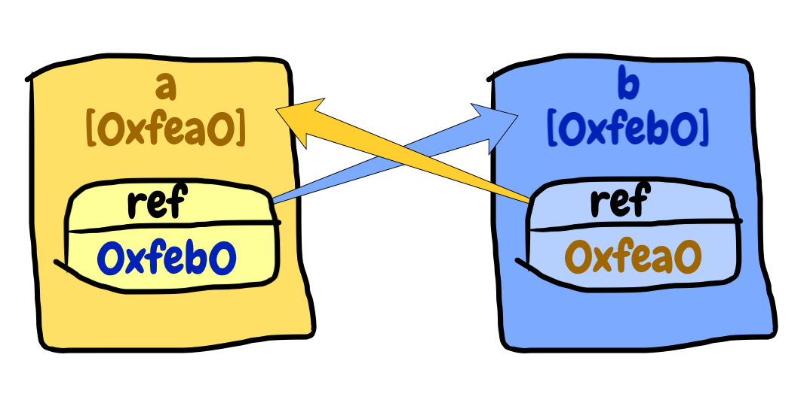

# 实验一 循环引用.java[0]
## 实验背景
很久很久以前，有一个来自阿拉伯的商人走到我的面前，问了我一个问题：我们都知道爪哇岛上不属于任何人的人，就要被当做垃圾，抓到一起杀掉。那么，有一对情侣，互相对天盟誓：亲爱的，我永远只属于你。也就是说，这两个人，互相属于对方，并不属于两人以外的任何人，他们俩会不会被作为垃圾杀掉呢？


我说：哥们儿，咱都是老老实实写代码的，能不能不故弄玄虚，把你脑袋上那个黑圈和旁边妹子的手帕拿下来，咱说点人话好不好？你不就是想问，在Java里，两个对象互相引用的时候，会不会被垃圾回收处理掉吗？

那人说：是的！你知道吗？

我说：你先把黑圈和手帕拿下来。

他听话地照做了，充满期待地看着我。

我呲牙一笑：不知道。

见他要把黑圈和手帕扣回去，我赶忙说：不过，我们可以设计个程序来搞清楚这个问题的答案。当然，你也可以去用Google搜索一大堆文档去查清楚(*我说过很久很久以前，那时候Google还可以在中华大地使用*)。不过，我们都是动手派，能自己动手搞定就先不去看那些[字都认识却不知道说的是啥的文档](http://www.baidu.com/s?wd=java%20循环引用&rsv_spt=1&rsv_iqid=0xf7839b1e00050004&issp=1&f=8&rsv_bp=0&rsv_idx=2&ie=utf-8&tn=baiduhome_pg&rsv_enter=1&rsv_sug3=8)了吧。

于是，本实验就诞生了。

后来，我把这个问题编入了我给别人面试的题目中。很多应聘人能给我正确答案，却不能给我一个可以证明答案的程序……不由得让我产生了幻视，总觉得他们简历上的名字是一个已故的上古人物——[赵括](https://baike.baidu.com/item/纸上谈兵/85581)。

## 实验题目
在Java中有两个对象，它们互相持有对对方的引用，这两个对象在垃圾回收运行时，是否会被回收。试用一段程序来得出结论。

----

这里是动脑动手分割线！请先想一下，看看能不能独立完成此实验。或者说，看看能不能答对我这道面试题。

----

好吧。走到这里的你，估计有这么几种可能性：

- 已经解决了问题，想看看你的实验设计更高明还是我下面的内容更值得学习
- 冥思苦想了很久，还是没有头绪，于是决定看看结果
- 动脑动手？我要向霍金学习，脑袋也动不了，手也动不了

不管是哪种可能性，我都无法阻止你继续读下去，大侠请继续，希望下面的内容能为你带来帮助。

----

## 题目步骤
不难看出，我们的实验主要有如下步骤：

1. 构造两个对象互相引用的场景
2. 让这两个对象没有其他变量引用
3. 让垃圾回收工作
4. 检查两个对象是否已被回收

那么，接下来就一步一步看看如何实现。

### 构造场景
古人云：无图无真相。虽然我们都是编码的人，但是拿张纸画张图有时候事半功倍。



图中，`a`和`b`，分别是两个对象，下面方括号里是他们的地址(当然里面的值是我瞎编的)。每个对象里都有一个属性`ref`，指向另一个对象。

> Java中除了有限的几个基本类型，其他变量都是引用，换句话说，其值都是一个对象的地址。为了更加形象生动，我们一般管这种叫变量指向了一个对象。
> 
> 这个事儿跟宫廷里面扎小人诅咒差不多，你在小人上写上某某的名字，这个小人就指向那个人了。你在这个小人身上扎一下，那边那个人就跟着犯病了。这就是通过变量操作对象的过程。

于是，有人给了我这样的程序：

```java
    ClassA a = new ClassA("a");
    ClassB b = new ClassB("b");
    a.setRef(b);
    b.setRef(a);
```

这样写对不对呢？**对**！

但是，总感觉多了点什么。或者说，写这个程序的人，或许没有完全搞清楚类和对象的区别。

我们说到的是两个对象，互相引用，并没有说这两个对象是应该属于一个类还是两个类。从图中可以看出，两个对象的结构其实是一模一样的，都是里面有一个`ref`，那么完全可以设计成隶属于一个类的。

所以，我们可以改成下面这样：

```java
    SomeClass a = new SomeClass("a");
    SomeClass b = new SomeClass("b");
    a.setRef(b);
    b.setRef(a);
```
    
那么，这段程序写在哪？答曰：`闷函数`，哦，对不起，忘了切输入法了，应该是`main()`函数。

完整文件是这样的：

```java
public class Main {
  public static void main(String[] args) throws InterruptedException {
    SomeClass a = new SomeClass("a");
    SomeClass b = new SomeClass("b");
    a.setRef(b);
    b.setRef(a);
  }
}
```

至此，第一步完。

后面几步，就很简单了。我今天就不在这里啰嗦了……

什么？我是个骗子？唉，好好说话，你扔鸡蛋干啥？西红柿也不行！

好的，好的，别急！我只是说今天不在这里啰嗦了，过几天继续，欢迎关注以获取更新通知。

