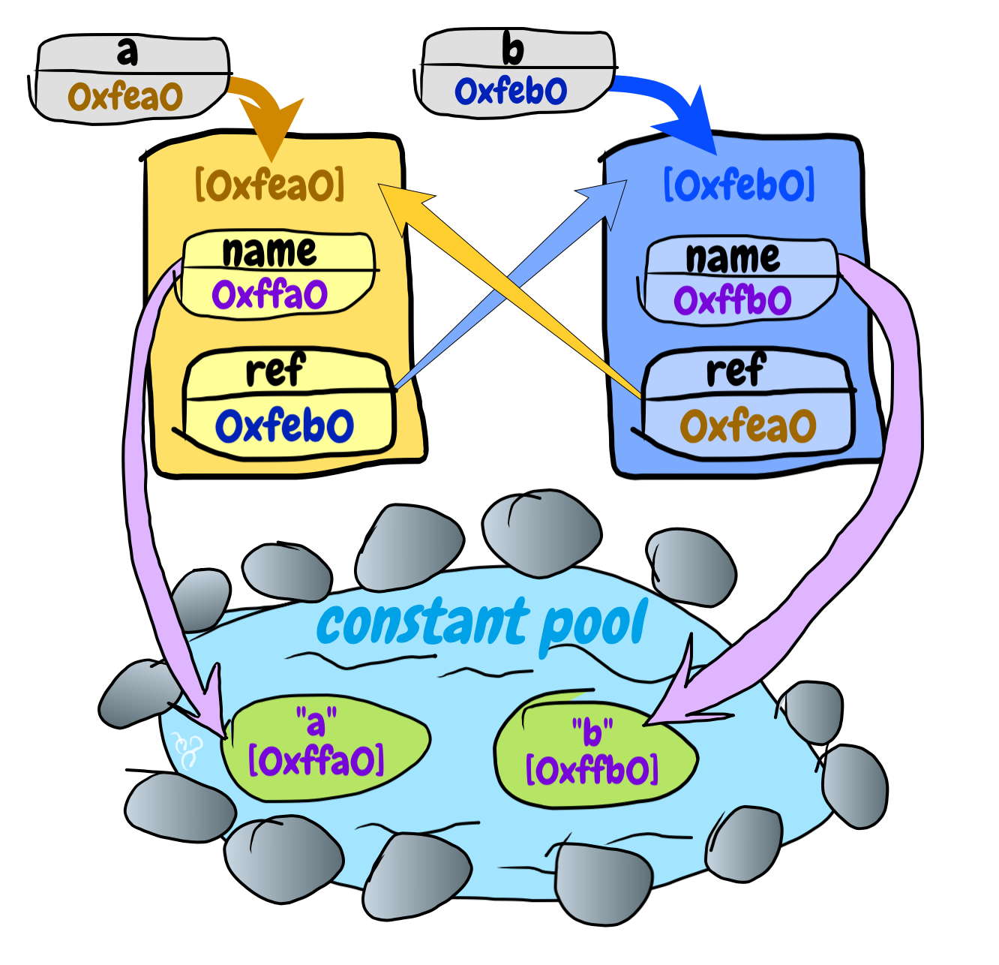
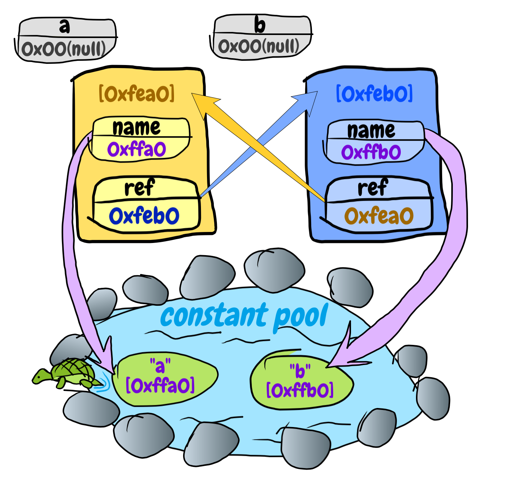
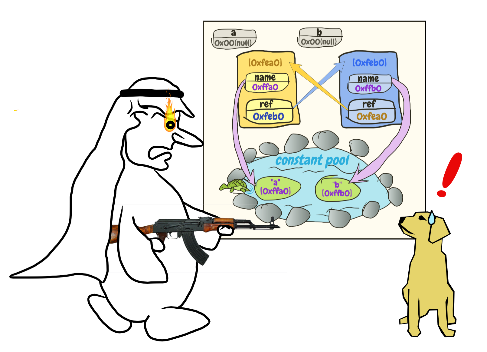

# 实验一 循环引用.java[1]
## 前情提要
在上一篇中，我们针对伪阿拉伯商人提出的问题，设计了如下实验步骤。

1. 构造两个对象互相引用的场景
2. 让这两个对象没有其他变量引用
3. 让垃圾回收工作
4. 检查两个对象是否已被回收

并写出了这样的程序

```java
public class Main {
  public static void main(String[] args) throws InterruptedException {
    SomeClass a = new SomeClass("a");
    SomeClass b = new SomeClass("b");
    a.setRef(b);
    b.setRef(a);
  }
}
```

完成了第一步……

“等等！”忽然伪阿拉伯商人大喊，“这第一步没完吧？`SomeClass`是个什么玩意儿？”

相信有经验的读者，早已知道`SomeClass`是个什么样的东西，这里为了那些经验尚浅的读者稍微解释一下。

`SomeClass`是本实验中自定义的一个新类。代码大致如下：

```java
public class SomeClass {
  private String name;
  private SomeClass ref;

  public SomeClass(String name) {
    this.name = name;
  }

  public void setRef(SomeClass ref) {
    this.ref = ref;
  }

  public SomeClass getRef() {
    return ref;
  }

  public String getName() {
    return name;
  }
}
```

当我们调用`new SomeClass("a")`的时候，就创建了一个`name`属性为`a`的对象。我们为什么需要一个`name`属性呢？后面自然会看出来。

## 孤立主角
完成第一步之后，Java虚拟机内存中大概是这个样子的。



成为我们主角的两个对象，现在还分别被`a`和`b`两个变量引用着。第二步，我们就要斩断最后的两根线，让他们孤立。

那么，怎么斩断引用呢？

很简单，让`a`和`b`不去引用它们就好了。

```java
a = null;
b = null;
```



> 为什么图里还有`a`和`b`？
> 
> 因为我们的函数还没有退出，在stack中的变量就不会消失。

至此，第二步就结束了。

> 清浅池塘里爬出的那只小乌龟，画得累死我了……

## 垃圾回收
接下来就是第三步了，让垃圾回收运转起来。

这一步最简单，因为`System`类有个静态函数`gc()`就是干这事儿的。

```java
System.gc();
```

## 检查结果
最后，看看两个对象是不是已经被回收了就好了。

怎么检查呢？

学过C++的朋友都知道，有一个东西叫析构函数（Destructor）。Java是从C++改造过来的，自然就把这个概念带过来了。

Java世界中的万物之母`Object`类有一个`finalize()`方法，在对象被销毁，也就是当做垃圾被回收的时候，这个`finalize()`方法会被系统调用。

我们这里要检查的是`SomeClass`的对象是否被回收，所以，我们只要在`SomeClass`类中实现自己的`finalize()`方法即可。

当`SomeClass`对象被回收的时候，我们让它有机会发出最后一声惨叫。

```java
  @Override
  protected void finalize() {
    System.out.println(String.format("%s is dying...!", this.name));
  }
```

> 这回你知道我为什么给`SomeClass`加了`name`属性了吧？就是为了让他们在临死前告诉世人，死的是哪一位。

所以，我们最后得到的完整程序是这样的：

### SomeClass.java
```java
public class SomeClass {
  private String name;
  private SomeClass ref;

  public SomeClass(String name) {
    this.name = name;
  }

  public void setRef(SomeClass ref) {
    this.ref = ref;
  }

  public SomeClass getRef() {
    return ref;
  }

  public String getName() {
    return name;
  }

  @Override
  protected void finalize() {
    System.out.println(String.format("%s is dying...!", this.name));
  }
}
```

### Main.java
```java
public class Main {
  public static void main(String[] args) {
    SomeClass a = new SomeClass("a");
    SomeClass b = new SomeClass("b");
    a.setRef(b);
    b.setRef(a);
    a = null;
    b = null;
    System.gc();
  }
}
```

我们来运行一下结果，看看是不是会得到两声惨叫呢？

运行结果如下：

```

```

不用找了，就是没有任何输出。我们没有看到有两声惨叫输出。

因此，我们可以得出结论：Java虚拟机的垃圾回收是无法处理循环引用的，循环引用的对象无法被回收。爪哇岛上的那对情侣可以天长地久地没羞没臊地生活下去………………“呆着！”



唉！有话好好说，你端着把枪是要干啥？！

阿拉伯商人一声怒吼：你不要在这里招摇撞骗，误人子弟！看我把你打成筛子！

等……等等……虽然是黄豆枪，打在身上也是很疼的，到底怎么回事儿？

我已经查过[字都认识却不知道说的是啥的文档](http://www.baidu.com/s?wd=java%20循环引用&rsv_spt=1&rsv_iqid=0xf7839b1e00050004&issp=1&f=8&rsv_bp=0&rsv_idx=2&ie=utf-8&tn=baiduhome_pg&rsv_enter=1&rsv_sug3=8)了，都说垃圾回收可以处理这种循环引用的！（虽然论证过程没看懂……）

可是……你也看到了，实验事实摆在这里……

阿拉伯商人挠了挠头：难道那些文章胡说？理论与实践脱节了？


*欲知到底原因为何？敬请期待下回分解。*

## 下期预告
> 最终，量子理论的提出，在一定程度上很好地解决了微观物理世界长久以来理论无法解释实验现象的问题……
> 

这谁把缅怀霍金的稿子掺到这里了？！

- ps. 关注专栏，可以及时获取更新。
- pps. 给文章多点几个赞，可以鼓励作者尽快更新。
- psp. 一款索尼出品的掌上游戏机，已于2014年停产……我没买过……