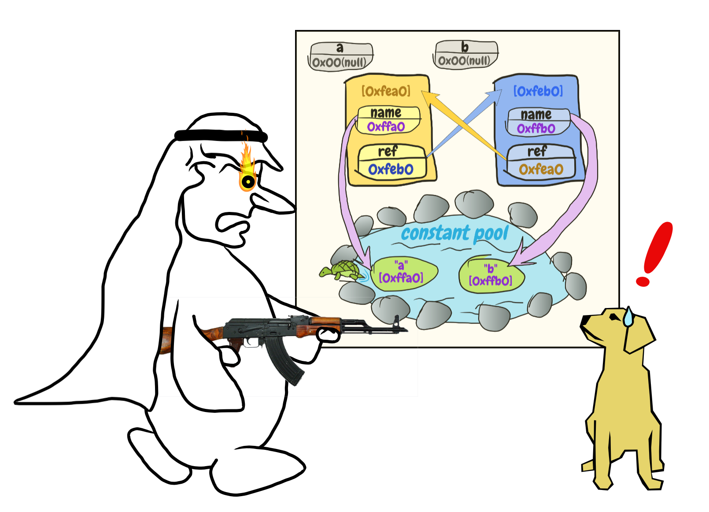

# 实验一 循环引用.java[2]
## 前情提要
上一篇中，我们按照设计好的实验步骤完成了实验，但得出的结论被伪阿拉伯人说是错的。


值此生死存亡之际，应该何去何从？

## 验证可疑之处
现在，我们重新审视一下我们的实验程序。

### SomeClass.java
```java
public class SomeClass {
  private String name;
  private SomeClass ref;

  public SomeClass(String name) {
    this.name = name;
  }

  public void setRef(SomeClass ref) {
    this.ref = ref;
  }

  public SomeClass getRef() {
    return ref;
  }

  public String getName() {
    return name;
  }

  @Override
  protected void finalize() {
    System.out.println(String.format("%s is dying...!", this.name));
  }
}
```

### Main.java
```java
public class Main {
  public static void main(String[] args) {
    SomeClass a = new SomeClass("a");
    SomeClass b = new SomeClass("b");
    a.setRef(b);
    b.setRef(a);
    a = null;
    b = null;
    System.gc();
  }
}
```

这里的`new SomeClass("a")`、`a.setRef(b)`等，都是我们在Java里用烂的东西，不太可能有问题。

那么，问题貌似集中到两点：

- `finalize()`方法是不是会在垃圾回收的时候被调用
- `System.gc()`方法是不是真的会启动垃圾回收

想要证明这一点，我们可以去掉循环引用，看看临终惨叫是不是会出现。

### Main.java
```java
public class Main {
  public static void main(String[] args) {
    SomeClass a = new SomeClass("a");
    a = null;
    System.gc();
  }
}
```

运行结果：

```
```

啊哈！这么看来，`finalize()`和`System.gc()`都是在胡扯呢，只看文档果然不靠谱啊！

有贤者曰：`System.gc()`只是建议垃圾回收，并不是一定会调用垃圾回收。所以，垃圾回收并没有运行……

又有贤者曰：垃圾回收就是一个传说，不可不信也不可全信……

## 插播漫画


请思考：一个人在正要惨叫之际，所处的世界被毁了，叫声是否还会发出来呢？

## 真相只有一个
> 真実はいつもひとつ！

看了上面漫画，我不由陷入了沉思……

重新审视我们的代码。可以看出，`System.gc()`是`main()`函数的最后一行。

当没有其他非守护线程存在时，`main()`函数执行结束，就意味着整个Java虚拟机进程的结束。对于Java世界中的一切，那一瞬间就是世界末日。

高效暗杀机构垃圾回收也好，早已准备好了遗言的垃圾对象也好，一切江湖恩怨，都在那一瞬不再具有意义。

> 滚滚长江东逝水，浪花淘尽英雄。是非成败转头空，青山依旧在，几度夕阳红。白发渔樵江渚上，惯看秋月春风。一壶浊酒喜相逢，古今多少事，都付笑谈中。

因此，会不会只是因为那个世界结束得太快，才使得我们没有得到任何输出？

让我们来实验一下。在`main()`函数最后一行，加上一个「ちょっと待て」（*日文，大意为：上帝啊，如果您听到了我虔诚的祈祷，请上厕所撒泡尿之后再来毁灭这污浊的世界吧！*）的语句。

```java
Thread.sleep(200);
```

完整代码如下：

```java
public class Main {
  public static void main(String[] args) throws InterruptedException {
    SomeClass a = new SomeClass("a");
    a = null;
    System.gc();
    Thread.sleep(200); // 上帝就是上帝，撒泡尿真快！
  }
}
```

执行结果

```
a is dying...!
```

经过了艰苦卓绝的努力，我们终于看到这一声临终惨叫了！

看来，**文档里说的都是大实话啊！**

## 重新检查结果
这样，我们再重新回到循环引用的问题中，同样在`main()`函数最后加上「ちょっと待て」的语句。

```java
Thread.sleep(200);
```

Main.java的完整代码：

```java
public class Main {
  public static void main(String[] args) throws InterruptedException {
    SomeClass a = new SomeClass("a");
    SomeClass b = new SomeClass("b");
    a.setRef(b);
    b.setRef(a);
    a = null;
    b = null;
    System.gc();
    Thread.sleep(200);
  }
}
```

重新运行程序，结果：

```
b is dying...!
a is dying...!
```


伪阿拉伯人看到这个结果，突然大哭起来：那对情侣，海誓山盟却不能天长地久！难道说，世间事大抵如此？

我稍微陪点眼泪，说：老兄，你想多了，如果不这样，爪哇岛如何控制人口？人终有一死，或轻于鸿毛，或重于泰山！我们只要精心设计每一个类，让他们在生时尽其所能，死而无憾就好了！

## 新闻！
正当我们打算结束这个实验的时候，一个人端着九号咖啡杯走了过来。

嗨！我给你们带来一个好消息！那个一直没什么卵用的`finalize()`函数，在Java 9里变成不推荐使用了！

啥？！

Java 9里`finalize()`不推荐使用了呀。就是`Deprecated`了。你瞧[这里](https://docs.oracle.com/javase/9/docs/api/java/lang/Object.html#finalize--)！

作为一个有代码洁癖的人，怎么可以让自己的实验代码里存在这种不知道哪天就被干掉的函数呢？

我必须寻找一个新的方法来完成实验！

## 下期预告

> 男人啊，就是要抓紧了才行。如果只是远远地看着，只靠微弱的暧昧来维系自己的思念，那男人不一定哪天就可能……被杀了！

- ps. 有谁知道macOS上比较好的画这种难看漫画的软件，欢迎评论推荐！我现在用的是一个在线的画图工具。https://sketch.io ，只要比这个强大就行。

