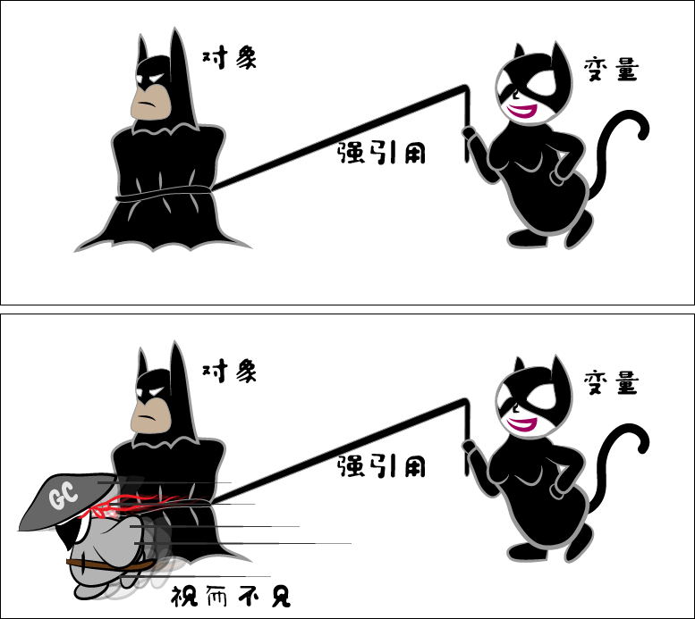
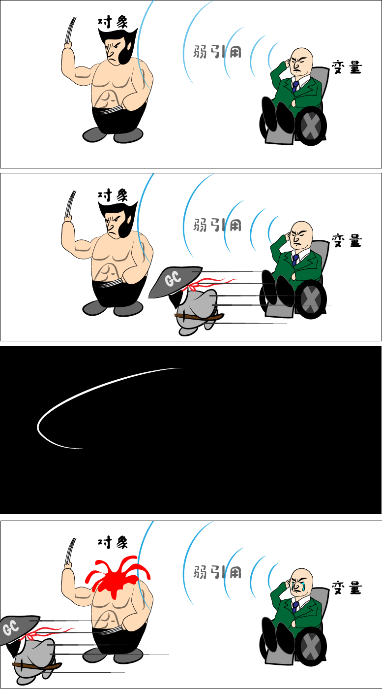
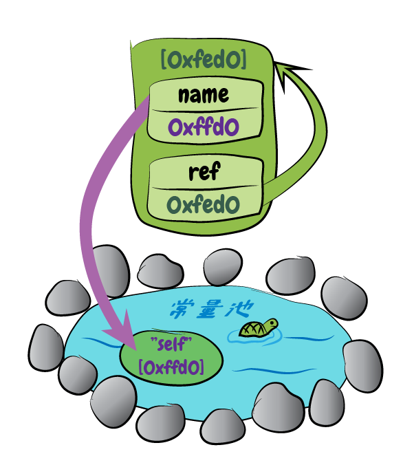

# 实验一 循环引用.java[3]
## 前情提要
上一篇中，我们已经在Java中完成了关于循环引用的实验。

这时，听到一个消息，在Java 9中，我们实验中用到的`finalize()`方法被归入了不推荐使用。

因此，我们希望可以找到一个新的方法来判断对象是否已经被回收。

## 引用的类型
我们通常使用的引用，是使用赋值操作符`=`来创建的。使用这种方式创建的引用，变量和对象之间有很强的羁绊，所以叫“强引用”。就好像有一个线拴在变量和对象之间。与之相对的是弱引用的概念，弱引用总是从遥远的地方默默地联系着对象，对垃圾回收来说弱引用是不可见的。Java中有一个弱引用类`WeakReference`，对应的就是这个概念。


垃圾回收运行起来的时候，凡是顺着变量的强引用能找到的对象，它都会放过一马。



反之，所有顺着变量的强引用不能找到的对象，都会被视作垃圾，杀之。


因为弱引用还是与对象有着弱弱的联系，所以，可以通过弱引用访问对象，也可以很容易地检测到对象是否已被垃圾回收处理掉。

在Java中，可以用`WeakReference`的`get()`方法来取得对象，当对象已经逝去的时候，`get()`方法返回的就是著名的`null`了。

## 换个方式检查垃圾回收的工作成果
于是，我们这次用弱引用来检查循环引用的对象是否被回收掉了。

之前的`Main.java`就可以改成这样：

```java
import java.lang.ref.WeakReference;

public class Main {
  public static void main(String[] args) {
    SomeClass a = new SomeClass("a");
    SomeClass b = new SomeClass("b");
    a.setRef(b);
    b.setRef(a);
    WeakReference<SomeClass> wra = new WeakReference<>(a);
    WeakReference<SomeClass> wrb = new WeakReference<>(b);

    System.out.println(a);
    System.out.println(b);
    System.out.println("--");
    System.out.println(wra.get());
    System.out.println(wrb.get());
    System.out.println("--");

    a = null;
    b = null;
    System.gc();

    System.out.println(wra.get());
    System.out.println(wrb.get());
    System.out.println("--");
  }
}
```

这里为了方便查看，首先把`a`和`b`分别输出出来，然后输出经由弱引用取出的对象，以确定弱引用确实可以取出对象，最后在去掉其他引用并调用垃圾回收后，再次通过弱引用来取出对象。

运行结果，毫无悬念。

```
SomeClass: a
SomeClass: b
--
SomeClass: a
SomeClass: b
--
null
null
--
```

前两次输出，是正常内容，最后输出的则是两个`null`，说明这对循环引用的对象被回收掉了。

什么？你说你跟我程序一样，但是运行的结果不同？

那就对了！因为我对`SomeClass`也做了一点小修改。去掉了`finalize()`方法，加上了可以让输出更加一目了然的`toString()`方法。

完整代码如下：

```java
public class SomeClass {
  private String name;
  private SomeClass ref;

  public SomeClass(String name) {
    this.name = name;
  }

  public void setRef(SomeClass ref) {
    this.ref = ref;
  }

  public SomeClass getRef() {
    return ref;
  }

  public String getName() {
    return name;
  }

  @Override
  public String toString() {
    return String.format("SomeClass: %s", this.name);
  }
}
```

至此，这个实验可以告一段落了。

## 展开
但是，作为一个精益求精的人，我们可不可以不用两个对象，只使用一个对象来构造循环引用呢？

还是先画个（有清浅池塘和小乌龟的）图吧。



有了图，代码就好构造了。

```java
import java.lang.ref.WeakReference;

public class Main {
  public static void main(String[] args) {
    SomeClass self = new SomeClass("self");
    self.setRef(self);
    WeakReference<SomeClass> wr = new WeakReference<>(self);
    System.out.println(self);
    System.out.println("--");
    System.out.println(wr.get());
    System.out.println("--");
    self = null;
    System.gc();
    System.out.println(wr.get());
    System.out.println("--");
  }
}
```

运行结果，仍旧是毫无悬念。

```
SomeClass: self
--
SomeClass: self
--
null
--
```

那么，我们能不能连自己做的这个`SomeClass`类也省了，只用Java自带的类来构造循环引用呢？

当然是可以的。而且，方法还有很多种。下面就抛砖引玉放一种。

```java
import java.lang.ref.WeakReference;
import java.util.Arrays;

public class Main {
  public static void main(String[] args) {
    Object[] a = new Object[1];
    a[0] = a;
    WeakReference<Object[]> wr = new WeakReference<>(a);
    System.out.println(Arrays.toString(a));
    System.out.println(Arrays.toString(wr.get()));
    a = null;
    System.gc();
    System.out.println(Arrays.toString(wr.get()));
  }
}
```

运行结果：

```
[[Ljava.lang.Object;@2471cca7]
--
[[Ljava.lang.Object;@2471cca7]
--
null
--
```

## 真实世界
说了这么多，或许有人要问：循环引用是不是仅存在于这种刻意设计的实验当中？

答案是否定的。

举个例子，`java.util.LinkedList`。这是一个双向链表，其中的每一个节点都同时引用前一个节点和后一个节点。那么相邻的两个节点就互相引用，从而构成了一个循环引用。

关于`LinkedList`的详细内容，可以参看[清浅池塘](https://www.zhihu.com/people/13641283343)的[Java那些事儿专栏](https://zhuanlan.zhihu.com/easyJava)中[LinkedList初探](https://zhuanlan.zhihu.com/p/28101975)一文，里面有详细的代码分析和横平竖直的内存对象图。不过，没有小乌龟。

## 尾声

到了这里，这一实验真的是可以告一段落了……


等等！这是啥？！**救命啊！！！！**


## 下期预告

🐍

