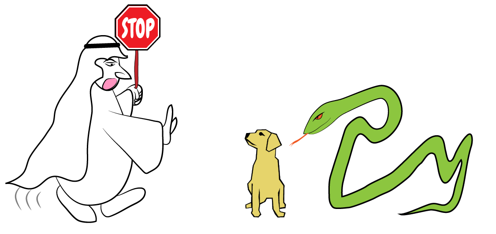

# 实验101 循环引用.python[0]
## 前情提要
上一篇中，我们完成了Java中关于循环引用的实验。

突然，一条蛇迎面扑来。

## 实验背景
定睛一瞧，发现是老朋友Python。

Python开口问：你们这实验做得挺Hi啊。要不要在俺身上也实验实验？

答曰：这有何不可？那就在你这3.6.*的新皮上来试试吧。

## 实验题目
在Python 3.6中有两个对象，它们互相持有对对方的引用，这两个对象在垃圾回收运行时，是否会被回收。试用一段程序来得出结论。

突然……

阿拉伯人大叫：难道你就不知道吃一堑长一智吗？

这突如其来的一句话，搞得我丈二和尚摸不着头脑。

阿拉伯人见我不得要领，接着说：记得Java那时候，你坑人的事儿不？不好好验证清楚，差点得出了错误的结论！

你说的是一开始我说垃圾回收无法处理循环引用的事儿啊！

是的。后来用单个对象重新实验，才找出问题的原因。

嘿嘿……君不知我的良苦用心啊！人都是在教训中成长的，先犯个错才印象深刻嘛。而且，你难道不知道读者们最喜欢看我们出错出丑吗？

好。你有理。不过，咱一步步走稳了，总行吧？先不要构造循环引用，先用一个对象试试看怎么样？

为什么？

你要知道，你这次要在Python上实验。现在学Python的人太多了，连小学生都开始学Python了！很多人连内存管理这茬都不知道呢！上回，我那个坦桑尼亚的兄弟跟我说，最近实在游戏玩腻了，没事儿就学了学Python。还有那次我去买菜，一大妈拉住我，说：大兄弟，听说你是搞计算机的，我最近学Python遇到了点问题，你给我讲明白了，我免费送你一个礼拜的菜！然后，前几天，我去收废品那儿卖瓶子，收废品的大叔也说他在学Python，还说打算搞搞机器学习，回头打算弄个能自动从垃圾里捡出值钱垃圾的机器人帮他。就刚刚，我老婆去做产检，给我发了个照片，一群初生的婴儿趴在那里，盯着前面的电脑，上面写着Python的程序……

好了好了，我知道了。我先用一个对象实验还不行？几行代码的事儿嘛。

```python
class SomeClass:
    def __init__(self, name):
        self.name = name

    def __del__(self):
        print(f"{self.name} is dying")


if __name__ == '__main__':
    a = SomeClass('a')
    a = None
    print('all done')
```

满意了吧？拿去自己看结果吧。对了，你刚刚是想说啥？刚出生的孩子们都在学Python了？

那个啊，我没说完。我是说，一群婴儿在看技术人员调试新上的程序。据说医院打算上一个婴儿脸识别及亲子脸孔相似度测试的系统，也是用Python写的……

我咬你！汪汪汪！

疼疼疼疼疼……等等！这程序运行结果不对劲！

## 下期预告
神是因信徒的香火而存在的，当最后一个信徒改变了信仰，神就消失了。

这就是传说中神一样的存在。