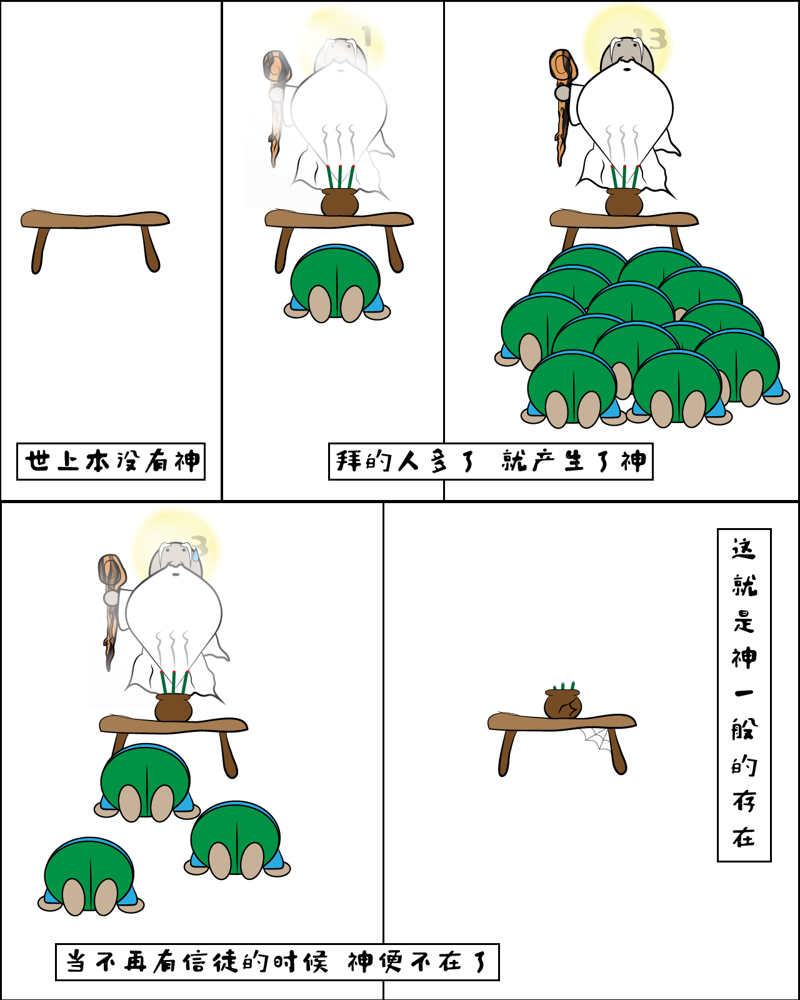

# 实验101 循环引用.python[1]
## 前情提要
上一篇中，我随手扔给阿拉伯人一个Python3下的循环引用实验代码，阿拉伯人大叫程序运行结果不对。

代码如下：

```python
class SomeClass:
    def __init__(self, name):
        self.name = name

    def __del__(self):
        print(f"{self.name} is dying")


if __name__ == '__main__':
    a = SomeClass('a')
    a = None
    print('all done')
```

## 迷雾重重

既然阿拉伯人说运行结果不对，那我们就运行一下看看吧。
结果：

```
a is dying
all done
```

结果一出，还没等我说啥呢，阿拉伯人又嚷上了：看吧，看吧，看吧！是不是结果不对？

我眨了眨眼，问：哪里不对？

阿拉伯人气得一边跺脚一边说：`a is dying`居然在`all done`之前就输出了！

那又怎样？Python的垃圾回收动作比较快嘛……疼疼疼！


阿拉伯人还没说什么，旁边的大蛇咔嚓一口咬下来。

面对如此生死攸关的局面，我只好说：好吧好吧，我知道了。我再加两行代码，让那捉摸不定的垃圾回收按照我们的意思来就好了！

```python
import gc


class SomeClass:
    def __init__(self, name):
        self.name = name

    def __del__(self):
        print(f"{self.name} is dying")


if __name__ == '__main__':
    gc.disable()
    a = SomeClass('a')
    a = None
    print('all done')
```

这下好了吧。我把垃圾回收关掉！运行一下看看吧。

```
a is dying
all done
```

看到这个结果，阿拉伯人和我都傻眼了。（当然，我是假装的，我怎么可能不知道其中的玄机呢？）

垃圾回收关掉了，为什么`a`还是死掉了呢？在一个没有杀手横行的世界，他是怎么死的呢？凶手到底是谁？！

## 大蛇带来的漫画



大蛇丢下漫画，轻描淡写地说了一句：Python里，都是神一样的存在……

阿拉伯人看完漫画沉思良久，说：原来如此！

我微笑着看着他，心想：孺子可教。

阿拉伯人又接着说：神居然是如此脆弱的存在啊……看来，我要小心呵护、诚心祈祷才行啊……

说完，又转过头，问大蛇：这漫画的内容，对女神也适用吗？

看来，我只有给分析透了，这二货才有可能明白其中真谛了。于是，我说：兄弟，我们是在谈Python中的内存分配问题，咱别跑题，好吧？

阿拉伯人说：好吧……可我还没对象呢……

我说：你先搞定Python里的对象，相信我，现实中的对象难搞多了。这个简单的你都搞不定，怎么能有对象。

阿拉伯人赶忙说：求指教！

我说：让我来给你点提示，漫画中的神就是Python中的对象，漫画中拜神的信徒，就是Python中对对象的引用……

阿拉伯人想了想，说：所以，一个对象没有引用了，就消失了？凭什么？

我说：你要问这个，这种做法叫引用计数。每个对象都有一本账，上面记着有多少变量引用了自己。当这个账上的数字为零了，对象就知道，自己是时候离去了。于是，就让自己尘归尘土归土了。

阿拉伯人双目噙泪说：多么高尚的对象啊！发现自己没用了，就自行了断，不等着垃圾回收……这样，就可以避免大屠杀导致的程序停滞了……

我给他擦了擦眼泪，又甩掉了他抹在我手上的鼻涕，说：你说得太对了！引用计数让内存在第一时间获得回收，不仅减少了内存的浪费，也不会像垃圾回收那样由于集中处理内存回收导致性能下降了。这是引用计数机制的一大优势。

既然理解了这一机制，再回到刚才的程序里。

```python
import gc


class SomeClass:
    def __init__(self, name):
        self.name = name

    def __del__(self):
        print(f"{self.name} is dying")


if __name__ == '__main__':
    gc.disable()
    a = SomeClass('a')
    a = None
    print('all done')
```

当`a = None`被执行的时候，之前创建的`SomeClass`的对象就没有任何变量引用了，所以，基于引用计数，这对象就自我销毁了。死前大叫一声。

阿拉伯人点了点头：我懂了。那我们快看看循环引用会怎样吧！

我打了个哈欠：下回再说吧。累了，我要去歇会儿了……

## 下期预告

皆大欢喜
